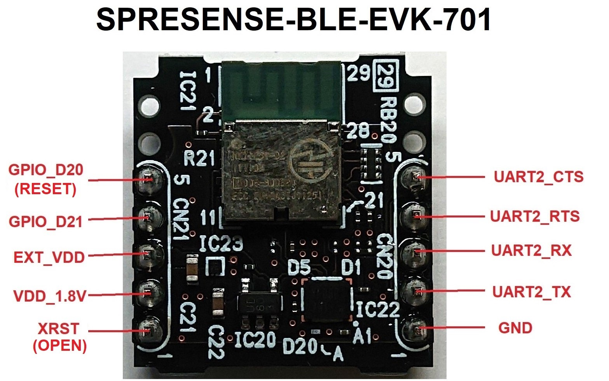
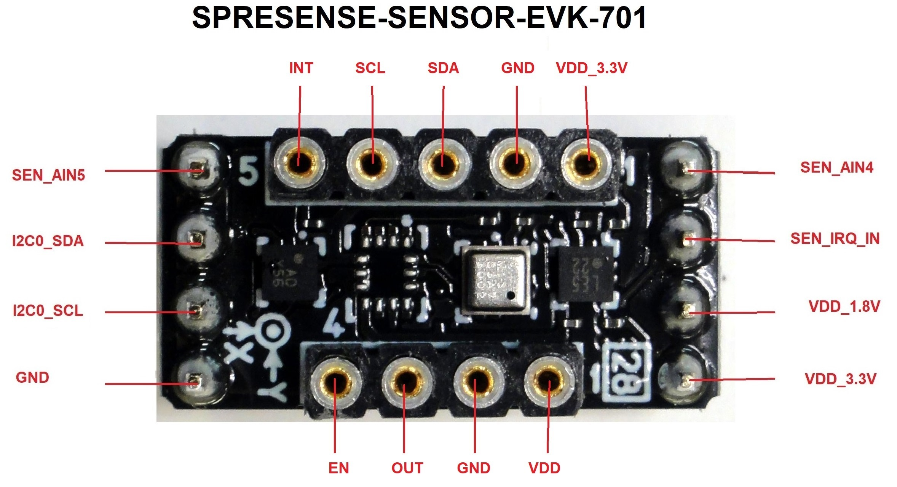
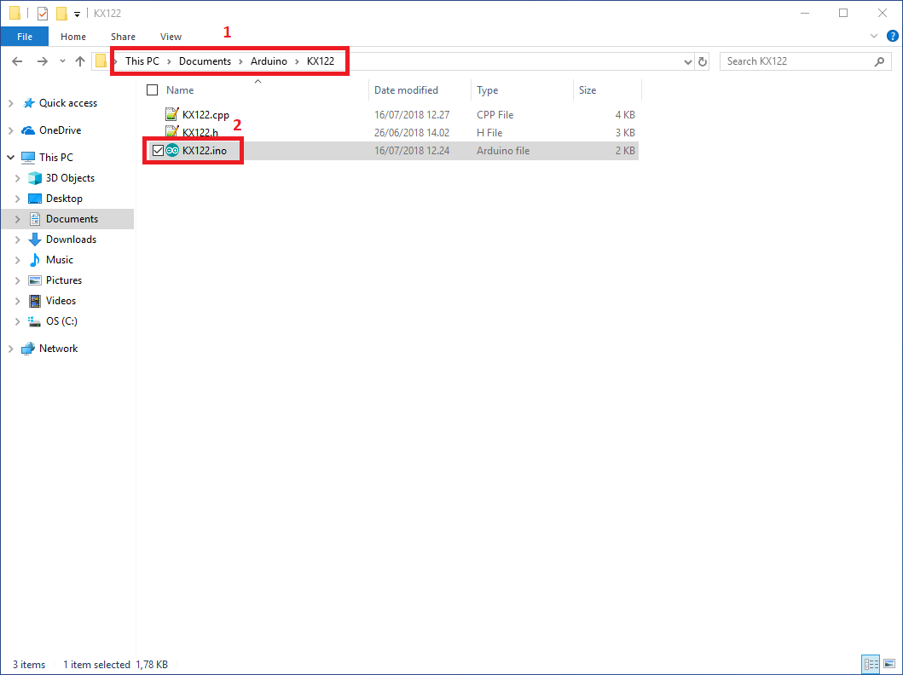
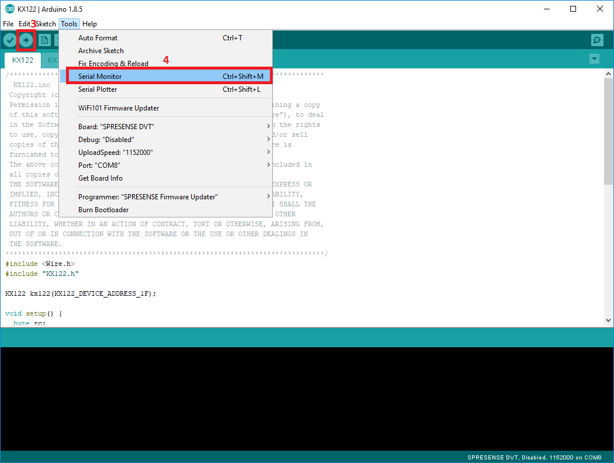
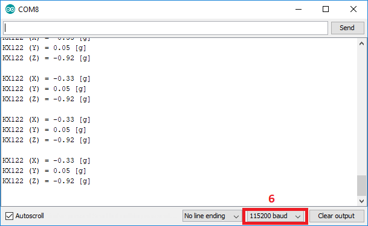

# Overview of this repository
Arduino libraries and samples for Rohm Sensors &amp; Bluetooth LE

## Supported devices
* Accelerometer KX122, I2C, SAD=0x1F
* Accelerometer KX224, I2C, SAD=<B>0x1E</B>*/0x1F
* Magnetosensor BM1422AGMV, I2C, SAD=0x0F
* Pressure sensor BM1383AGLV, I2C, SAD=0x5D
* Color sensor BH1749NUC, I2C, SAD=0x38/<B>0x39</B>*
* ALS/Proximity sensor RPR-0521RS, I2C, SAD=0x38
* Hall Effect sensor BD7411G, GPIO
* Bluetooth LE MK71251-02, UART

*Boldened is default device address 

## Pin assignment for Sensor and BLE Add-on boards

### BLE Add-on board:

### Sensor Add-on board:

## How to setup and test devices with Sony Spresense

About Sony Spresense
https://developer.sony.com/develop/spresense/

 For help regarding the installation of the Arduino IDE please refer to
 [Setting up the Arduino IDE](https://developer.sony.com/develop/spresense/developer-tools/get-started-using-arduino-ide/set-up-the-arduino-ide/ "Title")

 The example sketches are located in the same directory as the drivers.
 
 The evaluation board sensors can be attached to the Sensor Add-on board, and should work without problems.
 
###  Installing the sensor & BLE example sketches ###

1. Place the example sketches inside your Arduino folder, which should be located in your users documents folder
2. Open the folder of the example you want to test, and open the sketch file. The Arduino IDE should start with the selected sketch open

3. You can then proceed to upload the example sketch to your Spresense board by clicking <B>Upload</B>
* If the upload fails for some reason, you may need to reset your board or unplug and plug it back in
4. After the sketch has finished uploading, open the serial monitor by clicking Tools -> Serial Monitor or use the hotkey Ctrl+Shift+M

5. The sketch should start, if not, please reset the board by pressing the reboot button on the main board
6. To receive the correct data on the serial monitor, please ensure that the baud rate on the serial monitor is set correctly, usually to 115200

### Testing the bluetooth module

 You need to download the LAPIS BLE tool for your phone to test the module.

1. Open the MK71251-02 sketch, upload it and open the serial monitor
2. Open the LAPIS BLE tool on your phone, and enable bluetooth
3. Locate the MK71251-02 on the list of devices 
* If you do not see it on the list, you may need to reboot your board
4. Connect to the module
5. Open the serial port profile 
* Anything you type should show up on the serial monitor
* If you type 'Z', the serial port profile should show 'WRITING TEST'

